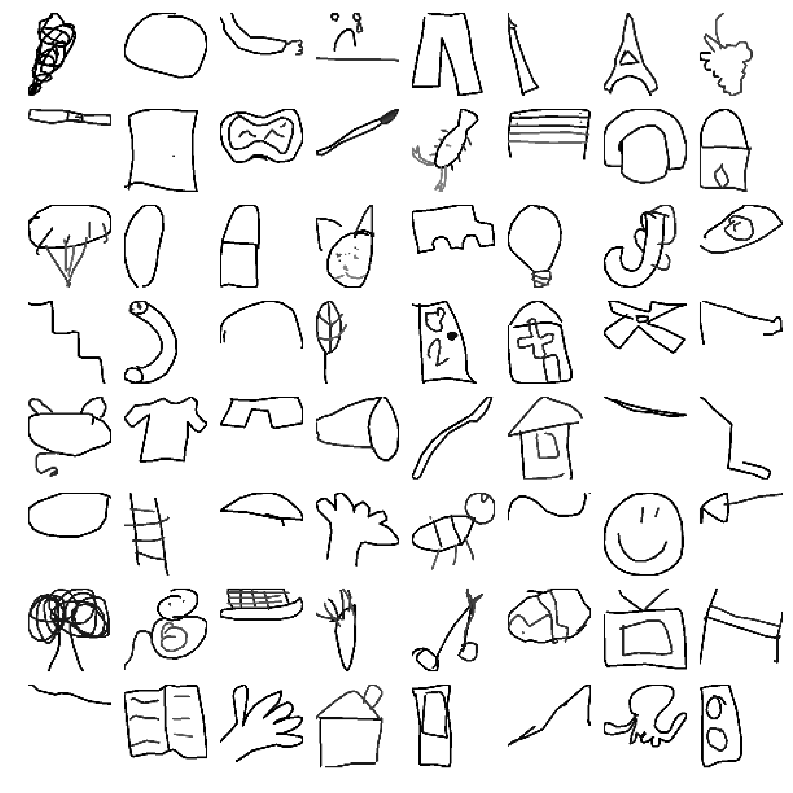

# Keras DenseNet 121 for [Quick, Draw! Doodle Recognition Challenge](https://www.kaggle.com/c/quickdraw-doodle-recognition)

### How accurately can you identify a doodle?

  

"Quick, Draw!" was released as an experimental game to educate the public in a playful way about how AI works. The game prompts users to draw an image depicting a certain category, such as ”banana,” “table,” etc. The game generated more than 1B drawings, of which a subset was publicly released as the basis for this competition’s training set. That subset contains 50M drawings encompassing 340 label categories.

Sounds fun, right? Here's the challenge: since the training data comes from the game itself, drawings can be incomplete or may not match the label. You’ll need to build a recognizer that can effectively learn from this noisy data and perform well on a manually-labeled test set from a different distribution.

Your task is to build a better classifier for the existing Quick, Draw! dataset. By advancing models on this dataset, Kagglers can improve pattern recognition solutions more broadly. This will have an immediate impact on handwriting recognition and its robust applications in areas including OCR (Optical Character Recognition), ASR (Automatic Speech Recognition) & NLP (Natural Language Processing).

This code is my solution for this challenge, it is a fork of [🐘 Greyscale MobileNet [LB=0.892]](https://www.kaggle.com/gaborfodor/greyscale-mobilenet-lb-0-892) from @beluga. Huge thanks for his great kernel

## Main architecture
### DenseNet 121
DenseNet architecture is new, it is a logical extension of ResNet. ResNet architecture has a fundamental building block (Identity)
where you merge (additive) a previous layer into a future layer. Reasoning here is by adding additive merges we are forcing the network 
to learn residuals (errors i.e. diff between some previous layer and current one). In contrast, DenseNet paper proposes concatenating 
outputs from the previous layers instead of using the summation.

[Densely Connected Convolutional Networks](https://arxiv.org/abs/1608.06993)

- Image Size: `64 x 64` (should be <= `512x512`)
- Batch Size: `330` (should be as big as possible)

## How to run
The code was developed with the following configuration:
* python 3.6.5
* opencv 3.4.0
* numpy 1.14.2
* keras 2.2.4
* pandas 0.23.4
* matplotlib 2.2.2
* tensorflow 1.7

Other configuration will reasonably work

After install all the dependencies, you need to go to https://www.kaggle.com/c/quickdraw-doodle-recognition/data to download all the data, extract all the zip file and put all of them into a folder `./input/`

Then run `python3 shuffle_csv.py` to split and shuffle the data, this may take a while since the amount of data is pretty big

After that you can run `python3 main.py`, the program will start to compile the model, draw image from the dataset and start traning the our model

You can use `submit.py` to create submission file from any saved weight.

By the way, I also have a Kaggle kernel for this exact code which you can use to run if you don't have GPU. You can check it out [here](https://www.kaggle.com/lamhoangtung/densenet-121-lb-0-925)

## Result

I'm able to achive LB **0.925** with a ***single DenseNet 121 model***, ***no TTA, no ensemble***. 100k/class for training, 340k for validation. ***After 45 epoch and 65 hours on a single GTX 1060 6GB.***

Which is pretty good with such limited hardware

## Suggession for improvement

You can try these to improve the LB score:
- Training with more data, you can use [shuffle_csv.py](shuffle_csv.py) to split and shuffle the data
- Bigger image size and bigger batch size (batch size should be as big as possible)
- Try DenseNet 169
- TTA (hflip) and ensemble

## Authors

**Hoang Tung Lam** - *Initial work* - [lamhoangtung](https://github.com/lamhoangtung)

## License

This project is licensed under the MIT License - see the [LICENSE.md](LICENSE.md) file for details
